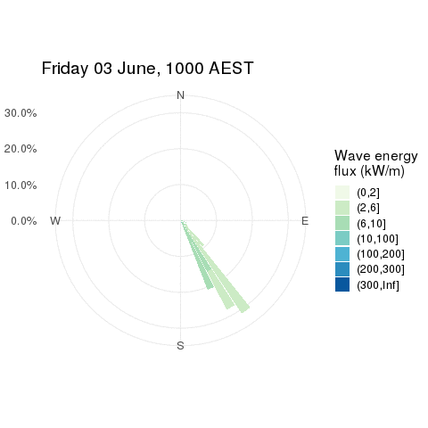

```{r setup, include=FALSE}
knitr::opts_chunk$set(echo = FALSE, warning = FALSE, message = FALSE)

library(ggplot2)
library(ncdf4)
```

# Background

On the 4th of June, 2016, an East Coast Low [^1] impacted New South Wales, causing wave overtopping and severe erosion in several areas. This event was a very intense, low pressure system that brought over 100mm of rainfall in one hour at places along the east coast NSW. Widespread rainfall totals exceeded 250mm along most of the NSW coast, leading to 21 catchments experiencing flooding and nearly all of the east-flowing rivers being affected. Periods of sustained gale force winds (over 63km/h) were recorded along the coast, and the Sydney Harbour experienced wind gusts of 116km/h. This intense event also coincided with tides near the Highest Astronomical Tide, combined with pressure-induced sea-level anomalies, and large north-easterly waves, which resulted in local inundation of low-lying areas and widespread coastal erosion (See [Louis et. al.](https://www.mhl.nsw.gov.au/data/realtime/wave/docs//2016NSWCoastalConferenceLouisCourieletal_Final.pdf) for more information).

This analysis investigates the role that storm waves may have played in the damaging event by extracting data from the CAWCR Wave Hindcast [^2] on the CSIRO THREDDS server.

# Obtaining the data

The wave data required for this analysis was the ww3.aus_4m.201606.nc file and can be accessed from THREDDS [in this collection](http://data-cbr.csiro.au/thredds/catalog/catch_all/CMAR_CAWCR-Wave_archive/CAWCR_Wave_Hindcast_aggregate/gridded/catalog.html). To minimise the file size, the ww3.aus_4m.201606 NetCDF4 file was subset server-side to only include the following variables:

- Wave energy flux.
- Peak wave direction.
- Significant wave height.
- Wave directional spread.

The dates and times of the data only included the interval from 0000 hours on the 3rd of June, 2016 to 2300 hours on the 9th of June, 2016, which covers the period of time of interest.

The data were downloaded programmatically using **R** (v3.5.3) from the [THREDDS data server NetCDF Subset Service](http://data-cbr.csiro.au/thredds/ncss/grid/catch_all/CMAR_CAWCR-Wave_archive/CAWCR_Wave_Hindcast_aggregate/gridded/ww3.pac_4m.201901.nc/dataset.html), and then read into **R** for data processing and creating spatiotemporal objects for analysis. Both of these steps can be reproduced using the [R/wave_data_download.R](R/wave_data_download.R) and [R/wave_data_import.R](R/post_process.R) files, respectively.

```{r}
# Read the NetCDF file into R
wave_nc = nc_open("Data/storm_wave_jun_2016.nc4")

# Process the data
source("R/post_process.R")
```

# Results

The following results are split into 3 different spatial scales, as shown in Figure 1, and defined below:

- The large region covering most of the east coast of Australia. This is also the region used in Figure 5 of Louis et. al. (this area is defined by the solid black line in Figure 1).
- A smaller region covering most of the NSW coast of Australia (this area is defined by the solid black line in Figure 1).
- A random location, just off the coast of Sydney (this location is defined by the small black dot).

```{r aus_map, fig.cap="Figure 1: Map of Australia (lightgrey polygons) showing the 3 different spatial scales in this analysis."}
ggplot(map_data("world", region = "Australia"), aes(long, lat)) +
  geom_polygon(aes(group = group), fill = "lightgrey") +
  theme_void() +
  coord_map(xlim = c(113, 160), ylim = c(-44, -10)) +
  geom_rect(aes(xmin = xmin(louis_fig5_ext),
                xmax = xmax(louis_fig5_ext),
                ymin = ymin(louis_fig5_ext),
                ymax = ymax(louis_fig5_ext)),
            fill = NA,
            colour = "black") +
  geom_rect(aes(xmin = xmin(nsw_ext),
                xmax = xmax(nsw_ext),
                ymin = ymin(nsw_ext),
                ymax = ymax(nsw_ext)),
            fill = NA,
            colour = "black",
            linetype = 2) +
  geom_point(aes(x = 153, y = -33.8))
```

## Large region covering most of the east coast of Australia

```{r large_region_analysis, fig.height=8, fig.cap="Figure 2: Time series plot showing the maximum significant wave height (top panel), and the maximum wave energy flux (bottom panel), for the entire region covering most of the east coast of Australia."}
max_cge_df %>% 
  left_join(max_hs_df, by = "date") %>% 
  tidyr::gather("var", "value", -date) %>% 
  mutate(var = ifelse(var == "max_cge", "Wave Energy Flux (kW/m)", 
                      "Significant Wave Height (m)")) %>% 
  ggplot(aes(date, value)) +
  geom_line() +
  facet_wrap(~var, ncol = 1, scales = "free_y") +
  labs(y = "Maximum value in the region") +
  scale_x_datetime(date_breaks = "day", date_labels = "%d %B") +
  theme_bw() +
  theme(text = element_text(size = 16),
        axis.title.x = element_blank())
```

## Smaller region covering most of the NSW coastline

The larger region analysis contains data from waves hitting the southern 
Australian coast. The direction of these waves may be very different than
those waves hitting the southeast coast of Australia, therefore the directional
analyses will focus on the smaller spatial scales.

```{r}
if (!file.exists("Animation/nsw_wave_directions.html"))
  source("R/create_animation/wave_dir_html.R")
```



<!-- ```{r} -->
<!-- htmltools::includeHTML("Animation/nsw_wave_directions.html") -->
<!-- ``` -->

## Point location off the coast of Sydney

```{r small_region_analysis, fig.height=5, fig.cap="Figure 3: Time series plot showing the direction from which the peak of the wave was travelling (black line), and the associated spread (light grey ribbon)."}
wave_dp_syd_df %>% 
  left_join(wave_spr_syd_df, by = "date") %>% 
  ggplot(aes(date, wave_dp)) +
  geom_line() +
  geom_ribbon(aes(ymin = wave_dp - wave_spr / 2, ymax = wave_dp + wave_spr / 2),
              alpha = .4) +
  scale_y_continuous(breaks = seq(0, 315, by = 45),
                     labels = c("N", "NE", "E", "SE", "S", "SW", "W", "NW")) +
  scale_x_datetime(date_breaks = "day", date_labels = "%d %B") +
  theme_bw() +
  theme(text = element_text(size = 16),
        axis.title.x = element_blank())
```


```{r}
# Close the connection to the NetCDF file
ncdf4::nc_close(wave_nc)
```


[^1]: [Holland, G. J., Lynch, A. H., & Leslie, L. M. (1987). *Australian east-coast cyclones. Part I: Synoptic overview and case study. Monthly Weather Review, 115*(12), 3024-3036.](https://journals.ametsoc.org/doi/10.1175/1520-0493%281987%29115%3C3024%3AAECCPI%3E2.0.CO%3B2)

[^2]: Durrant, Thomas; Hemer, Mark; Trenham, Claire; Greenslade, Diana (2013): CAWCR Wave Hindcast 1979-2010. v7. CSIRO. Data Collection. https://doi.org/10.4225/08/523168703DCC5
